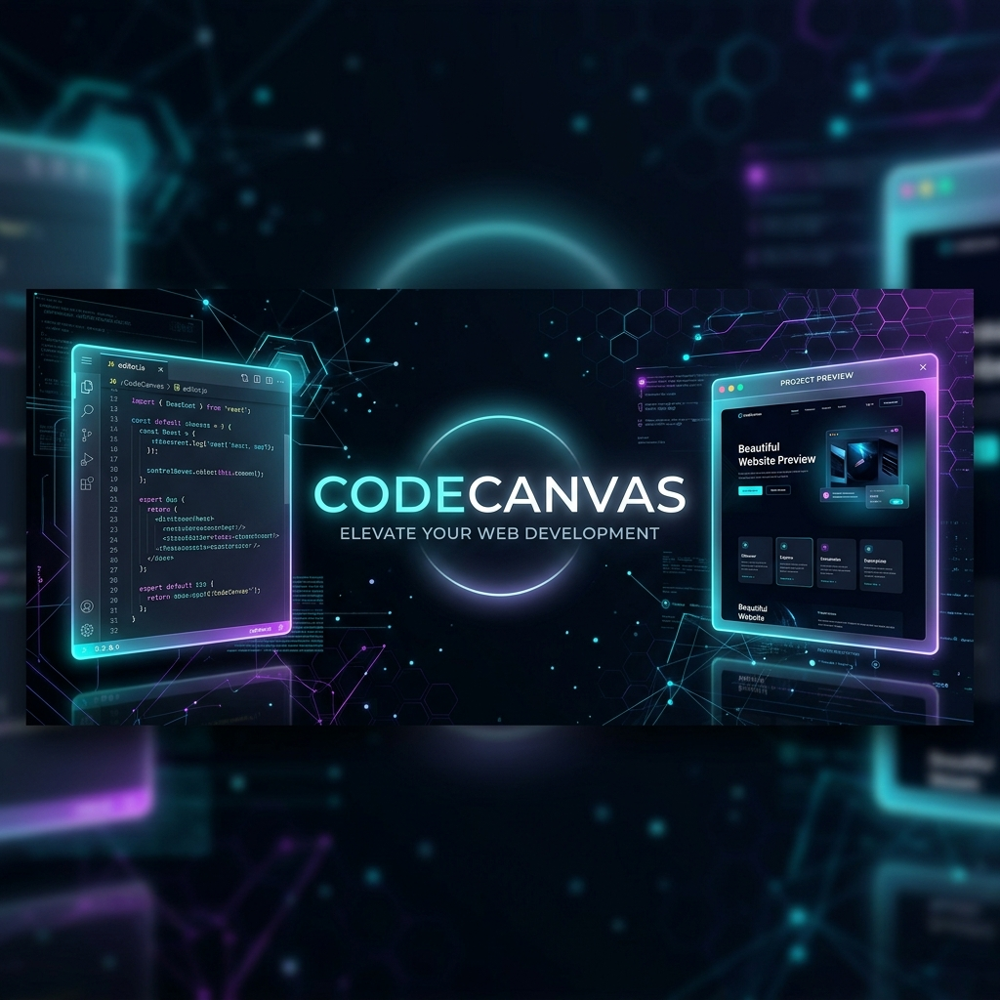
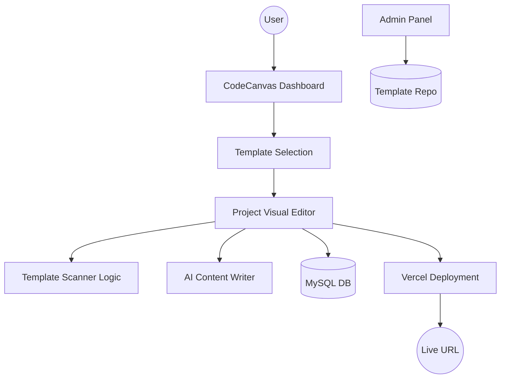

# 🎨 CodeCanvas — Beautiful, AI-Powered Portfolio Platform

<div align="center">
  
  
  <p align="center">
    <b>Empower Your Creativity. Build, Customize, and Deploy Professional Portfolios in Minutes.</b>
  </p>

  <p align="center">
    
    
    
    
    
  </p>
</div>

---

## ✨ Overview

**CodeCanvas** is a full-stack SaaS platform designed to bridge the gap between complex coding and simple website building. It allows users to browse high-quality templates, customize them through an intuitive **Visual Form-Based Editor**, and deploy their brand-new portfolios or business sites directly to the web with a single click.

Whether you're a developer looking for a quick portfolio or a business owner needing a modern landing page, CodeCanvas provides the tools to make it happen without touching a line of code.

---

## 🛠️ Key Features

### 🔍 Intelligent Template Scanner
Automatically extracts `{{placeholders}}` from any HTML template, transforming raw code into a structured, editable interface. No manual configuration required!

### ✍️ Dynamic Visual Editor
A real-time editing experience. As you fill out the categorized forms (Basic Info, Social Links, Image Uploads), the live preview iframe updates instantly on your screen.

### 🤖 AI Content Writer
Struggle with writing? Use our built-in AI assistant powered by **Gemini**, **Groq**, or **NVIDIA** to generate professional copy for your hero sections, services, and about pages.

### 🚀 One-Click Deployment
Integrated with the **Vercel API**, CodeCanvas allows you to ship your site to a live URL instantly. Fast, global, and reliable.

### 🔐 Secure & Scalable
- **Google OAuth**: Fast and secure login for all users.
- **Bcrypt Hashing**: Industry-standard security for local accounts.
- **PDO Prepared Statements**: Built-in protection against SQL injection.

---

## 🏗️ Architecture



---

## 🚦 Getting Started

### Prerequisites
- **PHP** 7.4 or higher
- **MySQL** 5.7+ / MariaDB
- **XAMPP/WAMP/MAMP** or a local server environment
- **Composer** (optional, for dependencies)

### Installation
1. **Clone the repository:**
   ```bash
   git clone https://github.com/harsh-pratap-singh-rathore/CodeCanvas.git
   ```
2. **Setup Database:**
   - Create a database named `codecanvas`.
   - Import the schema from `database/schema.sql` (if available) or use the setup script.
3. **Configure Environment:**
   - Copy `.env.example` to `.env`.
   - Fill in your database credentials and API keys (Google AI, Vercel, Resend).
4. **Launch:**
   - Open your browser and navigate to `http://localhost/CodeCanvas/index.php`.

---

## 🎨 Design Aesthetics
CodeCanvas follows a **Modern Glassmorphism** design language:
- **Neon Accents**: A vibrant mix of Cyan and Purple for interactive elements.
- **Dark Mode First**: Sleek, high-contrast interfaces for a premium feel.
- **Responsive Layouts**: Designed to look stunning on every device.

---

## 🤝 Contributing
Contributions are welcome! If you have a template you'd like to share or a feature idea, feel free to fork the repo and submit a PR.

---

<div align="center">
  <p>Made with ❤️ by <b>Harsh Pratap Singh Rathore</b></p>
  <p><i>Empowering creators, one canvas at a time.</i></p>
</div>
